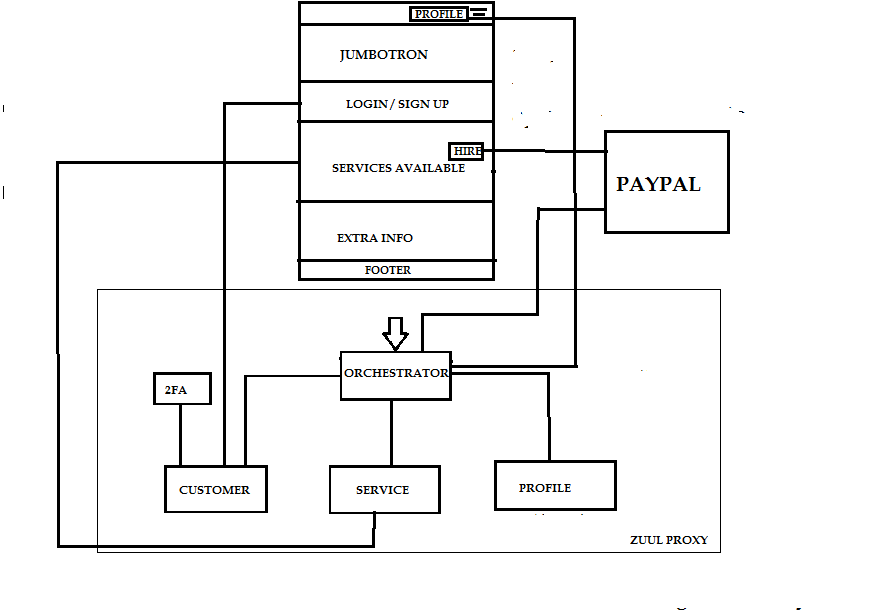
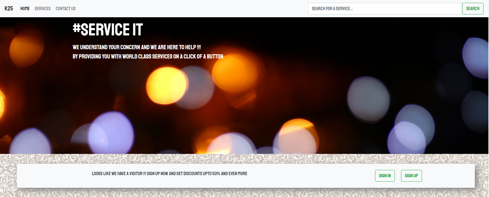
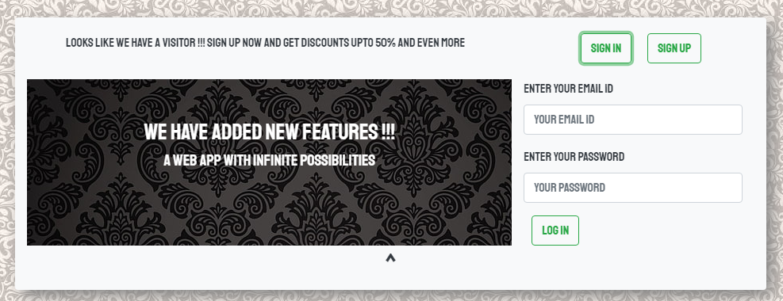
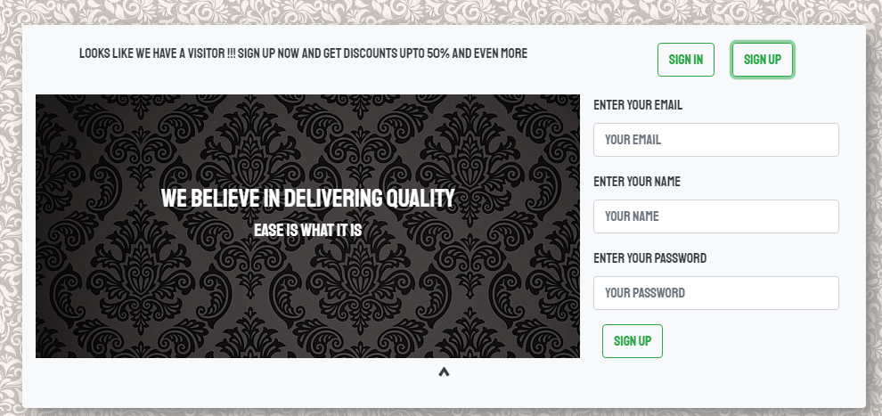
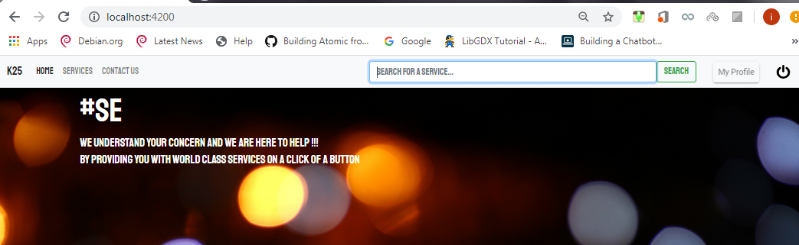
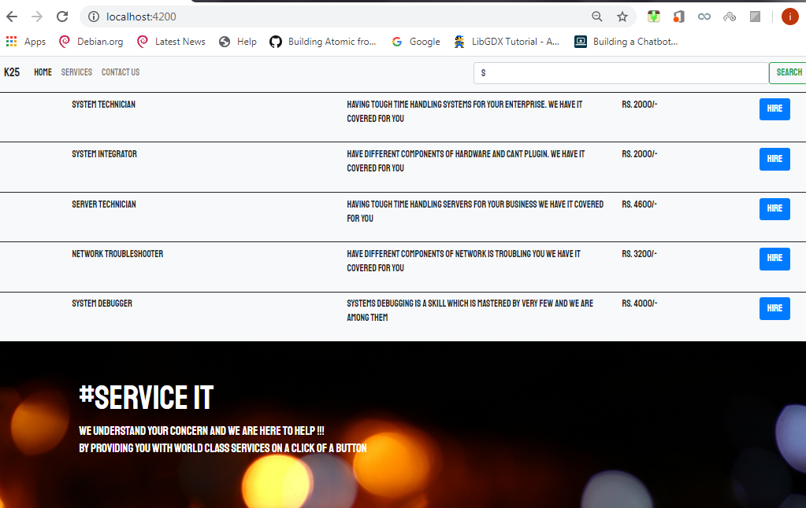
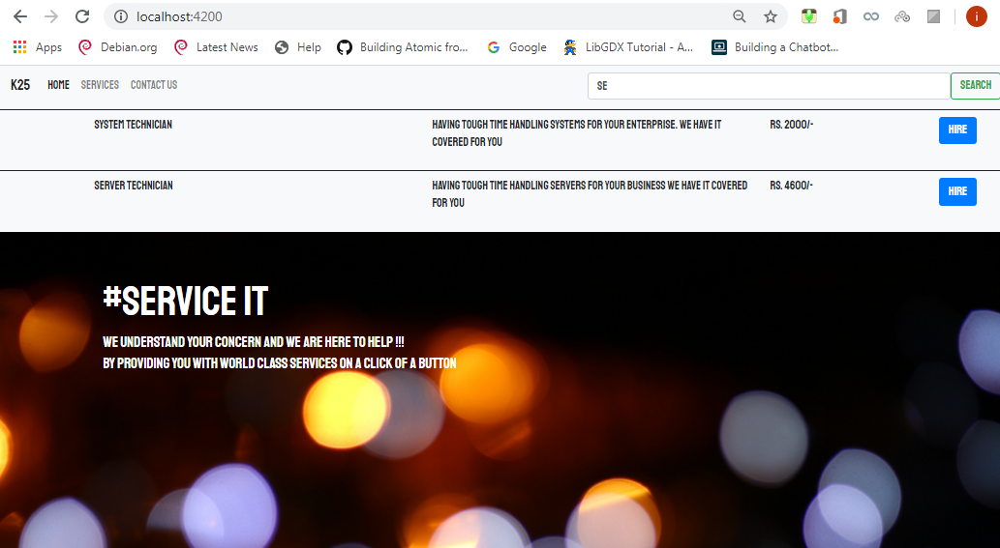
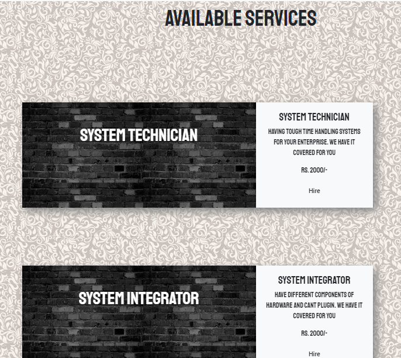
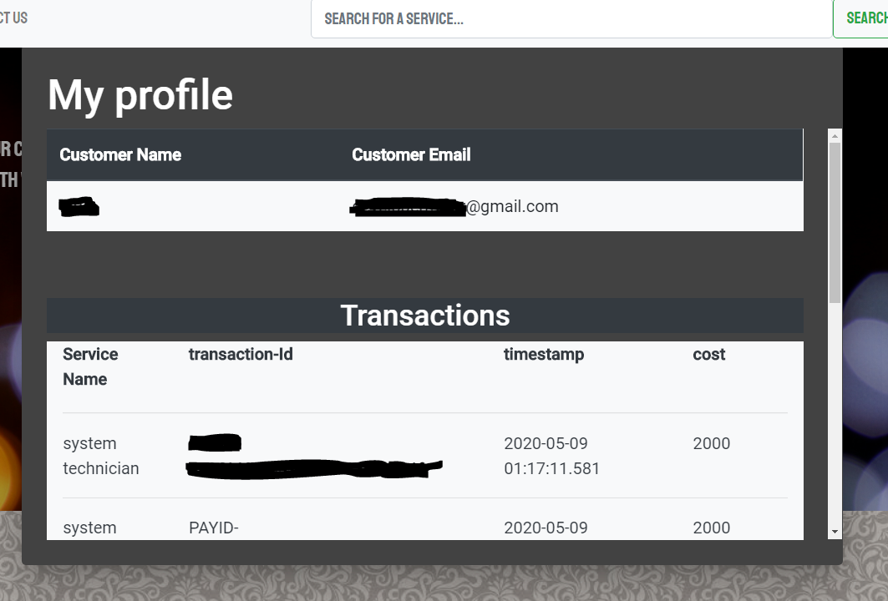

#service-market
This is a project to demonstrate the use of microservices and angular frontend

for the angular front end you will need to run these 
commands in your project folder
the place where you generate a component

1. for local storage
npm i ngx-web-storage --save

2. for material ui
ng add @angular/material

3. You will need a client key for the paypal to work

<h3>Architecture:</h3>

<h3>Screenshots</h3>

